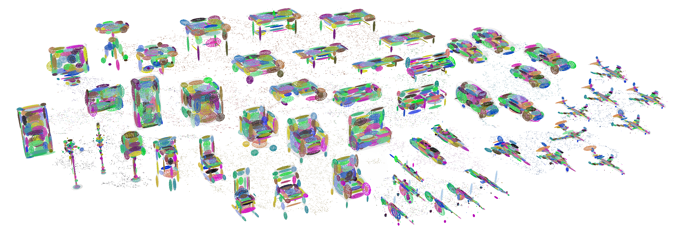
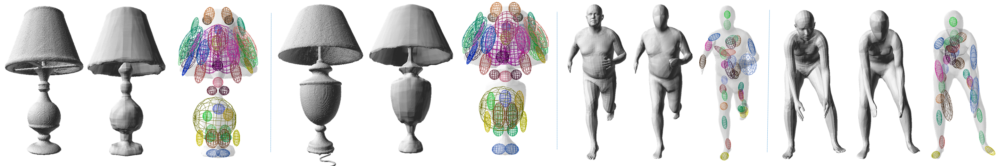

# Overview




This is a joint codebase for LDIF ([Local Deep Implicit Functions for 3D
Shape](https://arxiv.org/abs/1912.06126)) and SIF ([Learning Shape Templates
with Structured Implicit Functions](https://arxiv.org/abs/1904.06447)). Note
that LDIF was previously called Deep Structured Implicit Functions. It contains
code to reproduce the results of those papers, convert input meshes into the LDIF
and SIF representations, and visualize and extract meshes.
representations.

All .py and .sh files in the top-level
`ldif/` directory are entry points into the code (`train.py`, `eval.py`,
`meshes2dataset.py`, `unit_test.sh`, and `reproduce_shapenet_autoencoder.sh`).
The rest of this README provides information on initial setup and basic
documentation for those files. For additional documentation, please see each file.

## Environment

To set up the LDIF/SIF environment, follow these steps:

#### 1. Set up the python environment

The code was tested with python 3.6 and tensorflow 1.15 on linux. There is a
requirements.txt containing all dependencies.

If you use anaconda, run the following:

```
conda env create --name ldif -f environment.yml
conda activate ldif
```

If you use a system pip installation, run `pip install -r requirements.txt`

After this, the python environment should be ready to go. Please activate the
environment before proceeding. The build scripts include some python.

#### 2. Build GAPS

```./build_gaps.sh```

GAPS is a geometry processing library used by this package to generate the data
and create interactive visualizations. The script `build_gaps.sh` does the
following. One, it installs the necessary dependencies with apt. If sudo is
not available on the system, the requirements are that GAPS have include access
to standard OpenGL and GLu library headers (`GL/gl.h`, `GL/glu.h`) (on both linux and
macos), and that OSMesa static libraries can be linked (on linux). If these are
satisfied, the sudo line can be commented out. Two, it clones the
[GAPS](https://github.com/tomfunkhouser/gaps) repository from GitHub, make some
changes, and builds it. It also moves the qview folder into the gaps repository
and modifies the makefiles. The `qview` executable is a C++ program written using
GAPS to visualize SIF and LDIF representations. Finally, the script compiles all
necessary GAPS C++ executables, which are called by the python code. If this step
was successful, running `./gaps_is_installed.sh` should echo `Ready to go!`

GAPS should compile with no warnings. Please report any warnings by opening a
GitHub issue- the information would be greatly appreciated.

#### 3. Build the inference kernel (Optional, but highly recommended)

```./build_kernel.sh```

If successful, there should be a binary ldif2mesh in the ldif/ldif2mesh/
subdirectory. Note that the inference kernel assumes the CUDA toolkit is
installed and that a gpu supporting compute 6.1 (Pascal, so 10-series or newer)
is available. The nvcc command is part of the CUDA toolkit. If you have an older
gpu, you can try older compute versions for `--gpu-architecture` and `--gpu-code`,
but performance may be reduced and some newer features are used, so it might not
compile.

If you do not want to use the inference kernel or don't have a GPU, then you can
pass `--nouse_inference_kernel` to `eval.py`, which is the only script that
typically calls the kernel. It will then use pure tensorflow ops for evaluating
LDIF, as is done during training (for autodiff support). However, it would be
orders of magnitude slower, so it is really not recommended if more than ~20
meshes need to be evaluated.

The kernel should compile with no warnings. Please report any warnings by
opening a GitHub issue- this information would be greatly appreciated.

## Datasets

To run LDIF/SIF, first a dataset should be made. The input to this step is a
directory of watertight meshes, and the output is a directory containing the
files needed to train and evaluate LDIF/SIF.

Create an input directory somewhere on disk, with the following structure:

```[path/to/root]/{train/val/test}/{class names}/{.ply files}```

The properties of the dataset (# and name of classes, size of the splits, name
of examples, etc.) are determined from the directory structure. If you want to
reproduce the shapenet results, then see `./reproduce_shapenet_autoencoder.sh`. A
dataset doesn't need to have a train, test, and val split, only whichever splits
you want to use. You could make a dataset with just a test split for a
comparison, for example. Note that for convenience the code tries to check if
the class names are wordnet synsets and will convert them to shapenet names
(i.e. 02691156 -> airplane) if they are-- if it can't detect a synset it will
just use the folder name as the class name.

Note that .ply files are required, but the GAPS library provides a shell utility
for converting between file formats. You can do
`./ldif/gaps/bin/x86_64/msh2msh mesh.obj mesh.ply` as an example
conversion, which will read mesh.obj and write a new file mesh.ply to disk.

It is very important that the input meshes be watertight at training time.
GAPS provides a program msh2df that can do the conversion, if you are not
interested in exactly replicating the OccNet experiment's process. Here is an
example command that will make a unit-cube sized mesh watertight:

```
./ldif/gaps/bin/x86_64/msh2df input.ply tmp.grd -estimate_sign -spacing 0.002 -v
./ldif/gaps/bin/x86_64/grd2msh tmp.grd output.ply
rm tmp.grd
```
Msh2df outputs an SDF voxel grid, while grd2msh runs marching cubes to extract a
mesh from the generated SDF grid. The msh2df algorithm rasterizes the mesh to a
voxel grid and then floodfills at a resolution determined by the `-spacing`
parameter in order to determine the sign. The smaller the value, the higher the
resolution, the smaller the smallest allowable hole in the mesh, and the slower
the algorithm. The bigger the value, the lower the resolution, the bigger the
smallest allowable hole in the mesh, and the faster the algorithm. The run time
of both msh2df and of the rest of the dataset creation pipeline will vary greatly
depending on the `-spacing` parameter. The default value of 0.002 is quite high
resolution for a mesh the size of a unit cube.

While msh2df is provided as a utility, it was not used to generate the data for
the trained LDIF+SIF models. For reproducing the shapenet results, please use
the TSDF fusion package used by the
[OccNet repository](https://github.com/autonomousvision/occupancy_networks), not
msh2df.

To actually make a dataset once watertight meshes are available, run:

```
python meshes2dataset.py --mesh_directory [path/to/dataset_root] \
  --dataset_directory [path/to/nonexistent_output_directory]
```

Please see `meshes2dataset.py` for more flags and documentation. To avoid excess
disk usage (and avoid having to pass in the input directory path to all
subsequent scripts), symlinks are created during this process that point to the
meshes in the input directory. Please do not delete or move the input directory
after dataset creation, or the code won't have access to the ground truth meshes
for evaluation.

The dataset generation code writes 7-9mb of data per mesh (about 330GB for
shapenet-13).

## Training

To train a SIF or LDIF, run the following:

```
python train.py --dataset_directory [path/to/dataset_root] \
  --experiment_name [name] --model_type {ldif, sif, or sif++}
```

The dataset directory should be whatever it was set to when running
meshes2dataset.py. The experiment name can be arbitrary, it is a tag used to
load the model during inference/eval/interactive sessions. The `model_type`
determines what hyperparameters to use. ``ldif`` will train a 32x32 LDIF
with 16 symmetric and 16 asymmetric elements. ``sif`` will replicate the
SIF representation proposed in the SIF paper. ``sif++`` will train
an improved version of SIF using the loss and network from LDIF, as well
as gaussians that support rotation, but without any latent codes per element.
By default trained models are stored under `{root}/trained_models/`, but
this can be changed with the ``--model_directory`` flag. For more flags and
documentation, please see `train.py`.

It is also possible to make model types besides the paper version of LDIF/SIF.
For details, please see `ldif/model/hparams.py`. Both LDIF and SIF are stored as
specific hparam combos. Adding a new combo and/or new hyperparameters would be
the easiest way to evaluate how a modification to LDIF/SIF would change the
performance. It would also be how to turn off partial symmetry, or adjust
the number of shape elements or size of the latent codes. The only
special hyperparameter is batch size, which is read directly by the `train.py`
script, and always set to 1 during inference.

While training, the model write tensorboard summaries. If you don't have
tensorboard, you can install it with `conda install tensorboard` or
`pip install tensorboard`. Then you can run

```
tensorboard --logdir [ldif_root]/trained_models/sif-transcoder-[experiment_name]/log
```

assuming that `--model_root` was set to the default `ldif_root]/trained_models/`

Warning: Training an LDIF from scratch takes a long time. SIF also takes a while, though
not nearly as long. The expected performance with a V100 and a batch size of 24 is
3.5 steps per second for LDIF, 6 steps per second for SIF. LDIF takes about 3.5M steps
to fully converge on ShapeNet, while SIF takes about 700K. So that is about 10 days to
train an LDIF from scratch, and about 32 hours for SIF. Note that LDIF performance is
pretty reasonable after 3-4 days, so depending on your uses it may not be necessary to
wait the whole time. The plan is to 1) add pretrained checkpoints (the most pressing
TODO) and 2) add multi-gpu support, later on, to help mitigate this issue. Another
practical option might be switching out the encoder for a smaller one, because most
of the training time is the forward+backward pass on the ResNet50.

## Evaluation and Inference

To evaluate a fully trained LDIF or SIF network, run the following:

```
python eval.py --dataset_directory [path/to/dataset_root] \
  --experiment_name [name] --split {test, val, or train}
```

This will compute metrics over the dataset and then print out the result to the
terminal. By default, it will print out a table of results and LaTeX code. In
addition, there are flags `--save_results`, `--save_meshes`, and `--save_ldifs`,
which can be set to true. If they are set, the code will also write
1) pandas-readable CSV files containing the metrics for each mesh and class,
2) a directory of result meshes generated by the algorithm, and/or
3) a directory of txt files containing the actual LDIF/SIF representation
(parseable by qview, ldif2mesh, and the Decoder class in the ipynb). If these
flags are set, then `--result_directory` must also be provided indicating where
they should be written.

## Interactive Sessions

You can run the code interactively in an Jupyter notebook. To do so, open the
provided file `ldif_example_inference.ipynb` with Jupyter and attach
it to a python 3.6 kernel with the requirements.txt installed. Then follow the
prompts in the notebook. The notebook has a demo of loading a mesh, creating an
example, running inference, visualizing the underlying SIF elements, extracting
a mesh, and computing metrics. There is additional documentation in the .ipynb.

## Unit Tests

There is a script `unit_test.sh`. If you want to check whether the code is
installed correctly and works, run it with no arguments. It will make a small
dataset using open source models and train/evaluate an LDIF network. Note that
it doesn't train to convergence so that it doesn't take very long to run. As a
result, the final outputs don't look very good. You can fix this by setting the
step count in `unit_test.sh` higher (around 50K steps is definitely sufficient).

The code also has some unit tests for various pieces of functionality. To run a
test, cd into the directory of the `*_test.py` file, and run it with no arguments.
Please be aware that not all of the code is tested, and that the unit tests
aren't well documented. The easiest way to check if the code still works is by
running `./unit_test.sh`.

## Other code and PyTorch

In addition to the scripts described above, there are also model definitions and
beam pipelines provided for generating datasets and running inference on a
larger scale. To use these scripts, it would be necessary to hook up your own
beam backend.

There is also very limited PyTorch support in the `ldif/torch` directory. This code
is a basic implementation of SIF that can't train new SIF models, but can load
and evaluate SIFs generated by the tensorflow training+evaluation code. It is mainly
intended for using SIF correspondences as a building block of another unrelated
project in PyTorch. Note that PyTorch is not included in the `requirements.txt`, and
the `torch/` subdirectory is independent from the rest of the code base (it interacts
only through the `.txt` files written by the tensorflow code and takes no dependencies
on the rest of this codebase). To use it, it is probably easiest to just download
the `torch/` folder and import the `sif.py` file as a module.

## Updates to the code

* The code now supports tfrecords dataset generation and usage. This reduces
  the IO workload done during training. It is enabled by default. Existing
  users can git pull, rerun `meshes2dataset.py` with `--optimize` and 
  `--optimize_only`, and then resume training where they left off with the
  new dataset improvements. If you currently experience less than 100% GPU
  utilization, it is highly recommended. Note it increases dataset size by
  3mb per example (and can be disabled with `--nooptimize`).
  
* Support for the inference kernel on Volta, Turing and CC 6.0 Pascal cards
  should now work as intended. If you had trouble with the inference kernel,
  please git pull and rerun `./build_kernel.sh`.
  

## TODOS

This is a preliminary release of the code, and there are a few steps left:

* Pretrained model checkpoints are on the way. In the mean-time, please see
`reproduce_shapenet_autoencoder.sh` for shapenet results.
* This code base does not yet support training a single-view network. In the
  mean-time, the single-view network architecture has been provided (see
  `ldif/model/hparams.py` for additional information).
* While the eval code is fast enough for shapenet, the post-kernel
eval code is written in numpy and is an unnecessary bottleneck. So inference at
  256^3 takes a few seconds per mesh, even though the kernel completes in
  ~300ms.
* Pressing the 'f' key in a qview visualization session will extract a mesh
and show it alongside the SIF elements; however it only considers the analytic
parameters. Therefore, it shows a confusing result for LDIF representations,
  which also have neural features.
* To make setup easier, we would like to provide a docker container
that is ready to go.
